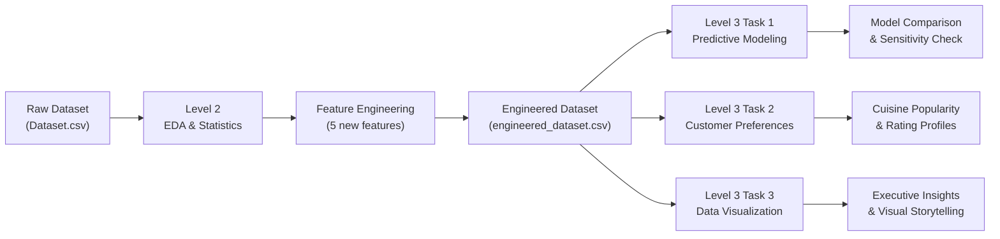

# 🍽️ Cognifyz Data Science & Machine Learning Internship

[](https://www.python.org/)
[](https://jupyter.org/)
[](https://scikit-learn.org/)
[](https://pandas.pydata.org/)
[](https://seaborn.pydata.org/)
[](LICENSE)

An end-to-end data analytics and predictive modeling project developed as part of the **Cognifyz Technologies Data Science Internship**. This repository implements **Level 2** (exploratory data analysis, statistical tests, and feature engineering) and **Level 3** (predictive modeling, customer preference analysis, and multi-factor visual storytelling) on a comprehensive restaurant dataset of 9,551 establishments across 21 attributes.

---

## 📌 Table of Contents

- [Overview & Pipeline](#-overview--pipeline)
- [Project Architecture](#-project-architecture)
- [Level 2: EDA & Feature Engineering](#-level-2-eda--feature-engineering)
  - [Task 1: Table Booking & Online Delivery](#task-1--table-booking--online-delivery)
  - [Task 2: Price Range Analysis](#task-2--price-range-analysis)
  - [Task 3: Feature Engineering](#task-3--feature-engineering)
- [Level 3: Predictive Modeling & Advanced Analytics](#-level-3-predictive-modeling--advanced-analytics)
  - [Task 1: Predictive Modeling](#task-1--predictive-modeling)
  - [Task 2: Customer Preference Analysis](#task-2--customer-preference-analysis)
  - [Task 3: Comprehensive Data Visualization](#task-3--comprehensive-data-visualization)
- [Model Performance Benchmark](#-model-performance-benchmark)
- [Installation & Quickstart](#-installation--quickstart)
- [Key Insights & Business Takeaways](#-key-insights--business-takeaways)
- [Technologies & Libraries](#-technologies--libraries)
- [License & Acknowledgments](#-license--acknowledgments)

---

## 🚀 Overview & Pipeline



---

## 📂 Project Architecture

```
Cognifyz/
├── Level-2/
│   ├── Task-1_Table_Booking_Online_Delivery/
│   │   ├── notebook.ipynb                 # Interactive task notebook
│   │   ├── README.md                      # Detailed methodology & findings
│   │   └── outputs/
│   │       ├── figures/                   # Generated PNG plots & charts
│   │       └── tables/                    # CSV tables of summary stats
│   ├── Task-2_Price_Range_Analysis/
│   │   ├── notebook.ipynb
│   │   ├── README.md
│   │   └── outputs/
│   ├── Task-3_Feature_Engineering/
│   │   ├── notebook.ipynb
│   │   ├── README.md
│   │   ├── data/
│   │   │   └── engineered_dataset.csv     # Level 2 → Level 3 handoff dataset
│   │   └── outputs/
│   ├── Dataset.csv                        # Base restaurant dataset (9,551 rows)
│   ├── requirements.txt                   # Level 2 dependencies
│   └── README.md                          # Level 2 overview
├── Level-3/
│   ├── Task-1_Predictive_Modeling/
│   │   ├── notebook.ipynb
│   │   ├── README.md
│   │   ├── models/                        # Serialized ML pipelines (.joblib)
│   │   └── outputs/
│   ├── Task-2_Customer_Preference_Analysis/
│   │   ├── notebook.ipynb
│   │   ├── README.md
│   │   └── outputs/
│   ├── Task-3_Data_Visualization/
│   │   ├── notebook.ipynb
│   │   ├── README.md
│   │   └── outputs/
│   ├── data/
│   │   └── engineered_dataset.csv         # Reused handoff dataset
│   ├── Dataset.csv
│   ├── requirements.txt                   # Level 3 dependencies
│   └── README.md                          # Level 3 overview
├── .gitignore                             # Git ignore rules for caches & checkpoints
├── LICENSE                                # MIT License
├── README.md                              # Root repository documentation (this file)
└── requirements.txt                       # Consolidated project dependencies
```

---

## 📊 Level 2: EDA & Feature Engineering

### Task 1 — Table Booking & Online Delivery
- **Objective:** Quantify the availability of table booking and online delivery services and measure their impact on restaurant ratings and price categories.
- **Key Findings:**
  - **Table Booking:** Only **12.12%** (1,158) of restaurants offer table booking, but they achieve a significantly higher average rating (**3.442** vs. **2.559**, a difference of **+0.883**).
  - **Online Delivery:** Available at **25.66%** (2,451) of restaurants. Availability is strongly concentrated in mid-tier restaurants (Price Range 2 at **41.31%**), while high-end establishments (Price Range 4) offer delivery at only **9.04%**.

### Task 2 — Price Range Analysis
- **Objective:** Identify the most prevalent price range and analyze the correlation between price tiers and aggregate ratings.
- **Key Findings:**
  - **Price Range 1 (Budget)** is the most common, accounting for **46.53%** (4,444) of restaurants, with an average rating of **2.000**.
  - Average ratings strictly scale with price tier:
    - Tier 1: `2.000` | Tier 2: `2.941` | Tier 3: `3.683` | Tier 4: `3.818`
  - The highest rated tier (Tier 4) maps to the dataset rating color **Yellow** (`Good`).

### Task 3 — Feature Engineering
- **Objective:** Extract and synthesize informative predictors without altering raw data or introducing target leakage.
- **Constructed Features:**
  - `Restaurant_Name_Length`: Length of name in characters (range: 2 to 54).
  - `Address_Length`: Length of address in characters (range: 13 to 132).
  - `Has_Table_Booking`: Binary indicator (1 = Yes, 0 = No).
  - `Has_Online_Delivery`: Binary indicator (1 = Yes, 0 = No).
  - `Cuisine_Count`: Count of cuisines offered (handling missing cuisines with 0).
- **Handoff Artifact:** Exported as `engineered_dataset.csv` for Level 3 machine learning tasks.

---

## 🤖 Level 3: Predictive Modeling & Advanced Analytics

### Task 1 — Predictive Modeling
- **Objective:** Formulate a regression pipeline to predict `Aggregate rating` on an 80/20 train/test split (`random_state=42`).
- **Leakage Prevention:** `Rating text` and `Rating color` are excluded from feature matrices as they are direct textual/color encodings of the target rating.
- **Trained Estimators:**
  1. **Linear Regression** (baseline parametric model)
  2. **Decision Tree Regressor** (non-linear tree baseline)
  3. **Random Forest Regressor** (ensemble method with 100 estimators)
- **Sensitivity / Ablation Analysis:** Evaluated model robustness with and without the `Votes` feature to test for vote-dependency.

### Task 2 — Customer Preference Analysis
- **Objective:** Dissect cuisine-level preferences by unbundling multi-cuisine listings (`Cuisines` column exploded).
- **Key Discoveries:**
  - **Top Popular Cuisines (by total votes):** North Indian, Chinese, Italian, Continental, Fast Food, American, Cafe, Mughlai.
  - **Highest-Rated Cuisines (min. 30 restaurants):** Sandwich, Steak, Sushi, Breakfast, Mediterranean, Bar Food, Indian, European, Seafood.
  - **Lowest-Rated Cuisines (min. 30 restaurants):** Biryani, Street Food, Tibetan, Raw Meats, Mithai (primarily driven by high concentration of budget/unrated entries).

### Task 3 — Comprehensive Data Visualization
- **Objective:** Synthesize analytical insights into high-impact visuals.
- **Visual Portfolio:**
  - Target distribution histograms (capturing the zero-rating "unrated" spike).
  - Cuisine performance comparison (top vs. bottom by rating and popularity).
  - Geographic city-level aggregate ratings (with sample size filtering).
  - Interaction charts: delivery/booking flags vs. rating across price bands.

---

## 📈 Model Performance Benchmark

### Test Set Comparison (`Aggregate rating` Prediction)

| Model | MAE | RMSE | R² Score |
| :--- | :---: | :---: | :---: |
| **Linear Regression** | 1.0333 | 1.2458 | 0.3181 |
| **Decision Tree** | 0.2847 | 0.4363 | 0.9164 |
| **Random Forest (Best)** | **0.1968** | **0.3016** | **0.9600** |

### Feature Ablation: Impact of `Votes`

| Model | R² (With `Votes`) | R² (Without `Votes`) | Impact / Variance Drop |
| :--- | :---: | :---: | :---: |
| **Linear Regression** | 0.3181 | 0.3054 | -0.0127 (stable) |
| **Decision Tree** | 0.9164 | -0.0481 | Severe degradation |
| **Random Forest** | **0.9600** | **0.4628** | Captures non-linear signals |

> [!NOTE]
> `Votes` serves as a strong proxy for popularity and confidence. When omitted, Random Forest still captures non-linear interactions across price ranges, cuisine counts, and service offerings, outperforming linear models.

---

## 🛠️ Installation & Quickstart

### 1. Clone the Repository
```bash
git clone https://github.com/ADITYA-tp01/Cognifyz-Project.git
cd Cognifyz-Project
```

### 2. Set Up a Virtual Environment
```bash
# Windows
python -m venv .venv
.venv\Scripts\activate

# macOS / Linux
python3 -m venv .venv
source .venv/bin/activate
```

### 3. Install Dependencies
```bash
pip install --upgrade pip
pip install -r requirements.txt
```

### 4. Running the Notebooks
Launch Jupyter Lab or Jupyter Notebook:
```bash
jupyter lab
```
Alternatively, execute any notebook non-interactively using `nbconvert`:
```bash
# Example: Run Level 3 Task 1
python -m jupyter nbconvert --to notebook --execute --inplace Level-3/Task-1_Predictive_Modeling/notebook.ipynb
```

---

## 💡 Key Insights & Business Takeaways

1. **Table Booking Boosts Perception:** Restaurants offering table booking average a **~0.88 higher rating**. Providing booking services signals elevated dining experience and customer service.
2. **Delivery Sweet Spot:** Online delivery is under-utilized in budget tier 1 (<16%) and rare in luxury tier 4 (<10%), but thrives in mid-tier (tier 2 at >41%). Mid-market dining operators benefit the most from delivery platform partnerships.
3. **Price Directly Correlates with Rating:** Higher price ranges consistently correlate with higher aggregate ratings (Tier 1: 2.00 vs. Tier 4: 3.82), reflecting customer expectations and service investments.
4. **Specialty Cuisines Attract Better Feedback:** Specialized cuisines (Steak, Sushi, Mediterranean) show significantly higher median ratings compared to high-volume fast casual categories.

---

## 🧰 Technologies & Libraries

- **Language:** Python 3.10+
- **Data Manipulation:** `pandas`, `numpy`
- **Visualization:** `matplotlib`, `seaborn`
- **Machine Learning:** `scikit-learn`
- **Model Serialization:** `joblib`
- **Environment:** `jupyter`, `ipykernel`, `nbconvert`

---

## 📜 License & Acknowledgments

- **License:** Distributed under the [MIT License](LICENSE).
- **Internship:** [Cognifyz Technologies](https://cognifyz.com/) Data Science & Machine Learning Virtual Internship Program.
- **Author:** [Aditya Raj](https://github.com/ADITYA-tp01)

---
*If you find this repository helpful, consider leaving a ⭐ on GitHub!*
